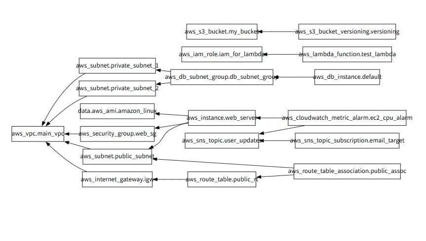

# ☁️ Terraform을 활용한 AWS 3-Tier & Serverless 인프라 구축

Terraform을 사용하여 AWS 상에 Web Server(EC2), Database(RDS), Serverless(Lambda) 환경을 코드로 구축(IaC)하고 관리하는 프로젝트입니다.

## 🎯 프로젝트 목표
- **Infrastructure as Code (IaC)**: 테라폼을 이용해 인프라의 생성, 변경, 삭제를 코드로 관리
- **비용 최적화(Cost Optimization)**: 학습용 인프라 구축 시 불필요한 비용 발생을 방지하기 위한 설정 적용 (Elastic IP 미사용 등)
- **Dependency Visualizing**: 리소스 간의 의존 관계 시각화 및 분석

## 🏗️ 아키텍처 및 의존성 그래프
Terraform Graph를 통해 시각화한 리소스 간의 관계도입니다. VPC를 중심으로 Subnet, EC2, RDS, Lambda 등이 연결된 구조를 확인할 수 있습니다.


<!-- 이미지 파일을 프로젝트 폴더에 넣고 경로를 맞춰주세요 -->

## 🛠️ Tech Stack
- **IaC**: Terraform 5.x
- **Cloud Provider**: AWS (ap-northeast-2 / Seoul)
- **Compute**: EC2 (Amazon Linux 2), Lambda (Python 3.9)
- **Database**: RDS (MySQL 8.0)
- **Storage**: S3
- **Monitoring**: CloudWatch Alarm, SNS

## 💡 주요 구현 내용

### 1. 테스트를 위해서 저비용을 위한 네트워크 구성
AWS의 IPv4 요금 정책 변경에 대응하여, 학습 목적의 인프라 비용을 절감하기 위해 퍼블릭 IP 할당을 제어했습니다.
```hcl
resource "aws_instance" "web_server" {
  # ...
  associate_public_ip_address = false  # 비용 발생 방지
}
```

### 2. Lambda 배포 자동화 준비

Python 소스 코드를 테라폼이 인식할 수 있도록 압축하고, 코드 변경 시 해시값을 비교하여 자동 배포되도록 구성했습니다.

## 🚀 How to Run

### 1. 초기화 및 압축 파일 생성
```
# Lambda 배포용 패키징
zip lambda_function.zip main.py

# Terraform 초기화
terraform init
```

### 2. 계획 확인 및 적용
```
terraform plan
terraform apply
```

### 3. 리소스 정리 (과금 방지)
```
terraform destroy
```

### 4. 리소스 간의 관계도 생성
```
이 다이어그램은 `terraform graph > graph.dot` 명령어를 사용하여 .dot 파일을 생성한 후
https://dreampuf.github.io/GraphvizOnline/ 사이트에서 이미지를 생성하였습니다.
```